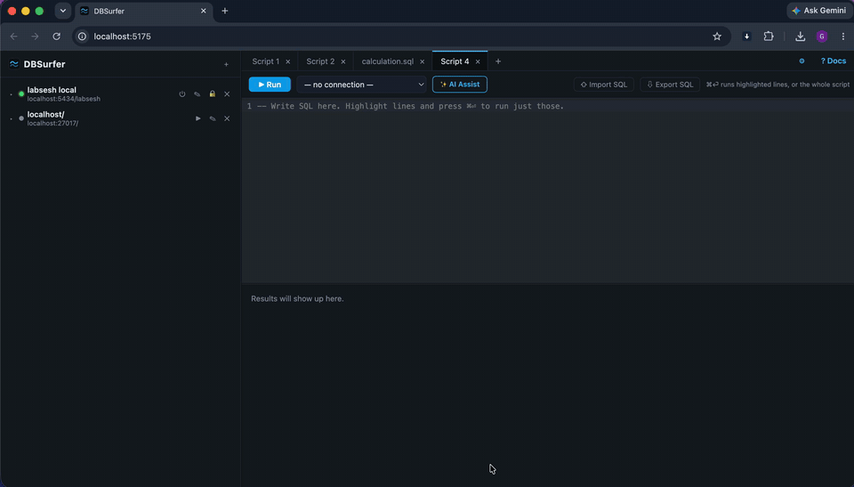
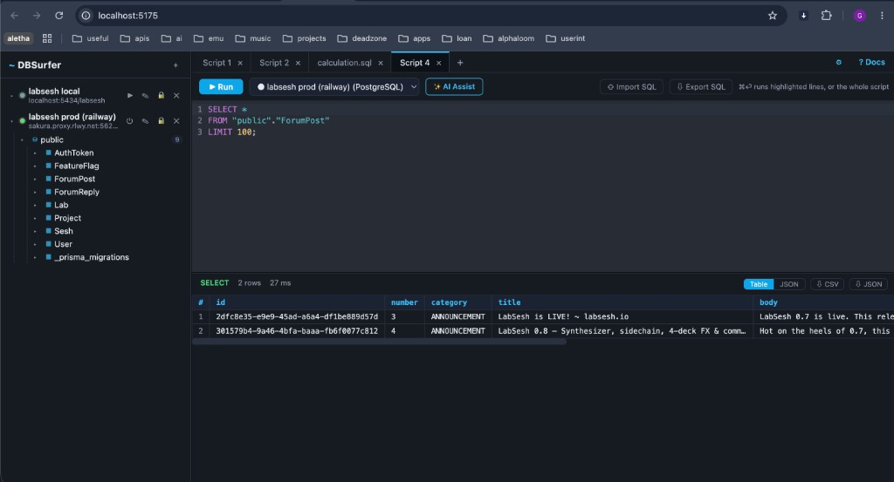

<p align="center">
  
</p>

<h1 align="center">DBSurfer</h1>

<p align="center"><strong>Open-source, browser-based DBeaver alternative. Multi-DB, local-first.</strong></p>

<p align="center">Connect to Postgres, MySQL, SQL Server, SQLite, MongoDB, and Redis from one clean UI that runs entirely on your machine.</p>

<!-- Record a short GIF (connect to a DB, highlight a query, hit Run) and save it as docs/demo.gif, then uncomment: -->
<!-- <p align="center"></p> -->



## Install

Works on macOS, Linux, and Windows. Needs [Node.js](https://nodejs.org) 20+.

```bash
npm install
npm start
```

Open http://localhost:4400 and add your first connection.

### Docker

```bash
docker build -t dbsurfer .
docker run -p 4400:4400 -v dbsurfer-data:/root/.dbsurfer dbsurfer
```

To reach a database running on the Docker host, use `host.docker.internal` instead of `localhost` in the connection form.

### Desktop launcher (macOS)

```bash
scripts/make-desktop-app.sh
```

Creates **DBSurfer.app** and **Stop DBSurfer.app** on your Desktop. Safe to click repeatedly. Logs go to `~/.dbsurfer/run/dev.log`. Re-run the script if you move the repo.

## Features

- Connect to PostgreSQL, MySQL/MariaDB, SQL Server, SQLite, MongoDB, and Redis
- Save connections locally for fast reconnects (paste a URL to autofill)
- Optional saved passwords, or session-only, clearable any time
- Schema browser: tables, columns, indexes, foreign keys, procedures
- Right-click to generate SELECT / INSERT / UPDATE / DELETE / CREATE / DROP SQL
- Edit values directly in the results grid and save them as a batch UPDATE
- Unlimited SQL tabs, each pinned to a connection
- Run the highlighted selection (or the whole script) with `Cmd/Ctrl + Enter`
- Import/export `.sql` files and connection settings
- Results as a table or JSON; export CSV or JSON
- Docs cheat sheet per database type
- Optional AI Assist (bring your own OpenAI / Anthropic / Google key)

## Development

```bash
npm install
npm run dev
```

Runs the API (Express, port 4400) and the UI (Vite + React + CodeMirror, port 5175) with hot reload. Open http://localhost:5175.

## Data and security

- Connections (and optional passwords) live in `~/.dbsurfer/connections.json`, outside this repo
- AI keys live in `~/.dbsurfer/ai.json`
- Both files never leave your machine except when talking to a database or AI provider you chose
- DBSurfer is local-first by design. Keep it on localhost, or put auth in front before exposing it to a network

## Contributing

Contributions are welcome. See [CONTRIBUTING.md](CONTRIBUTING.md) for setup and ideas for a first PR.

## License

MIT. See [LICENSE](LICENSE).
